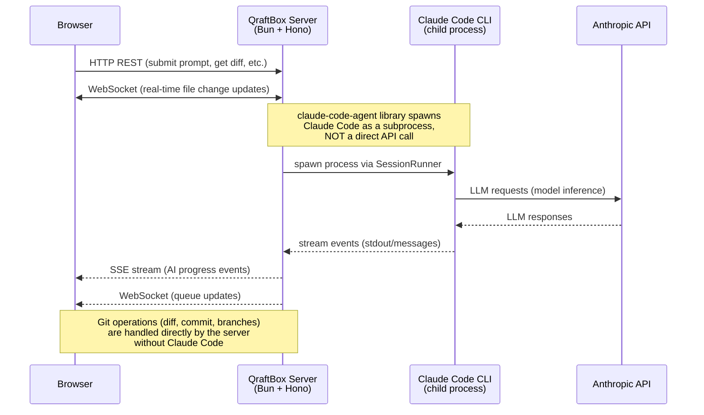
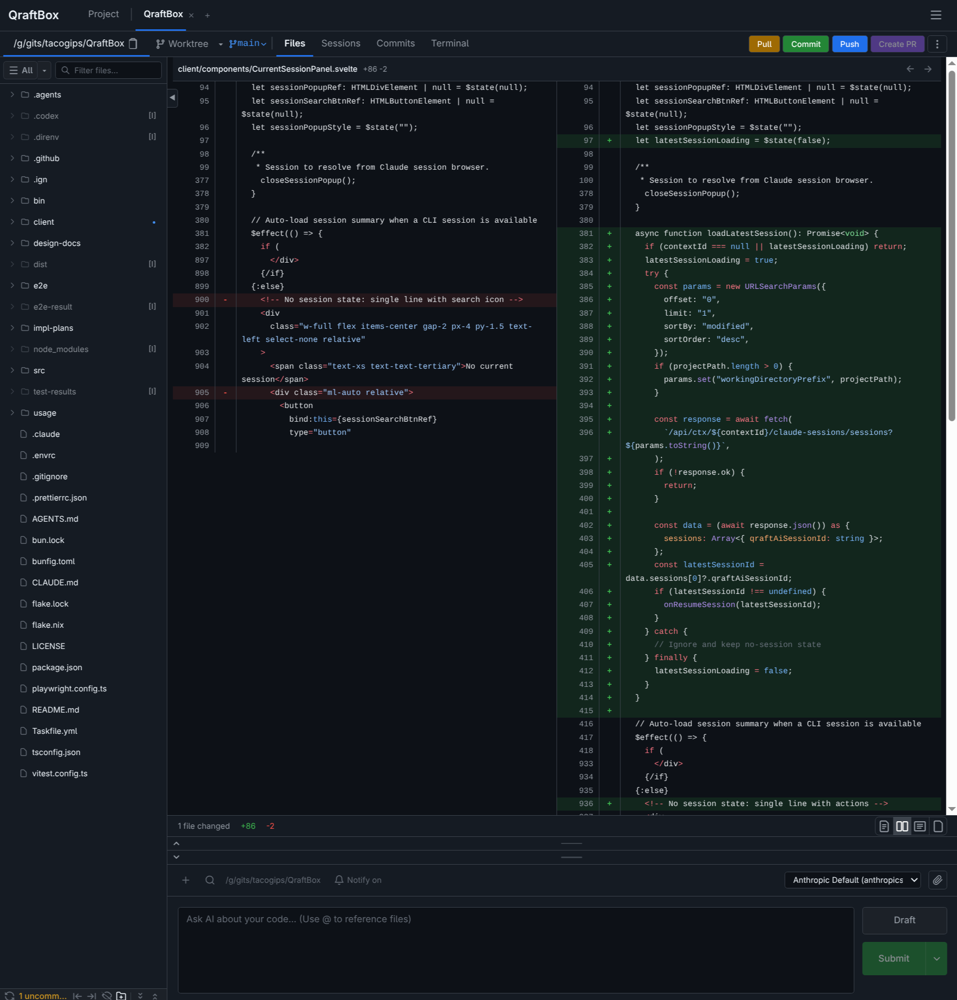
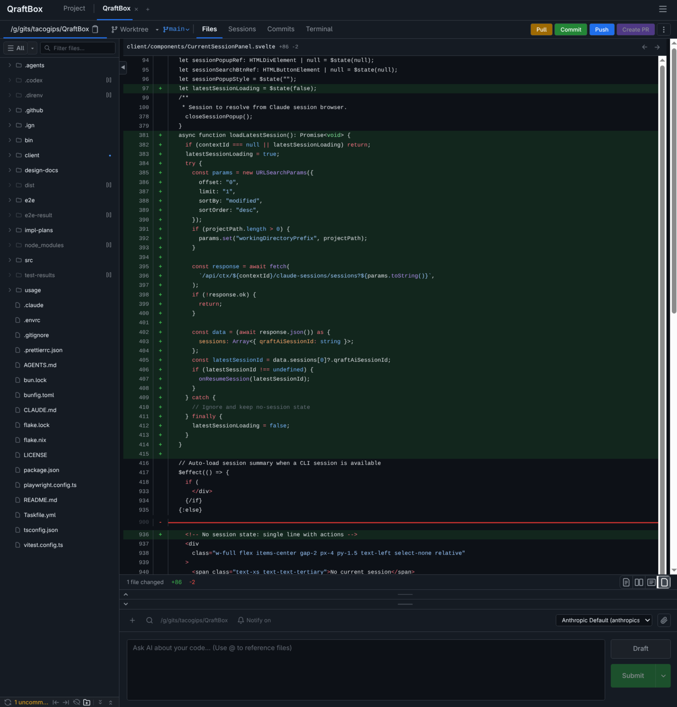
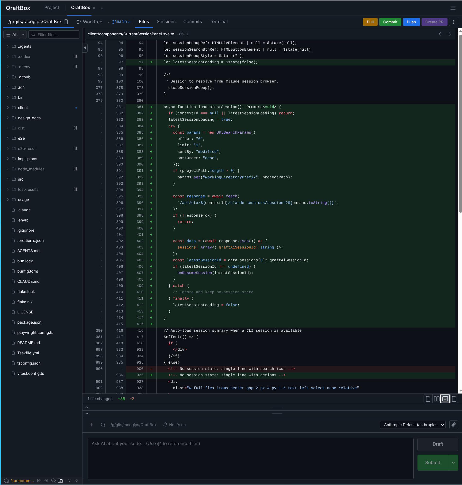
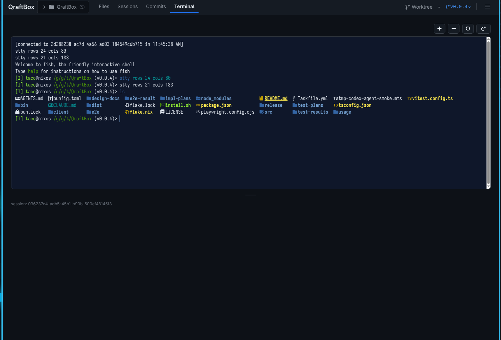
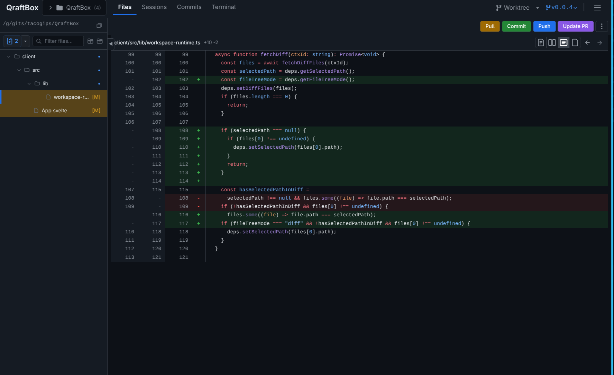
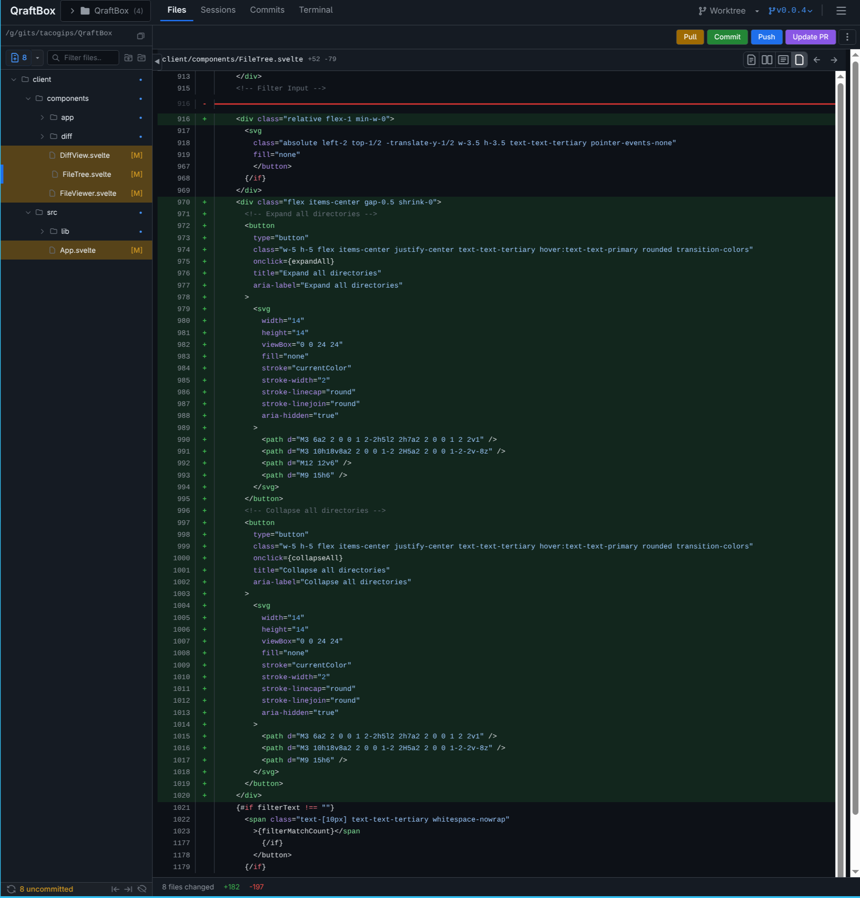
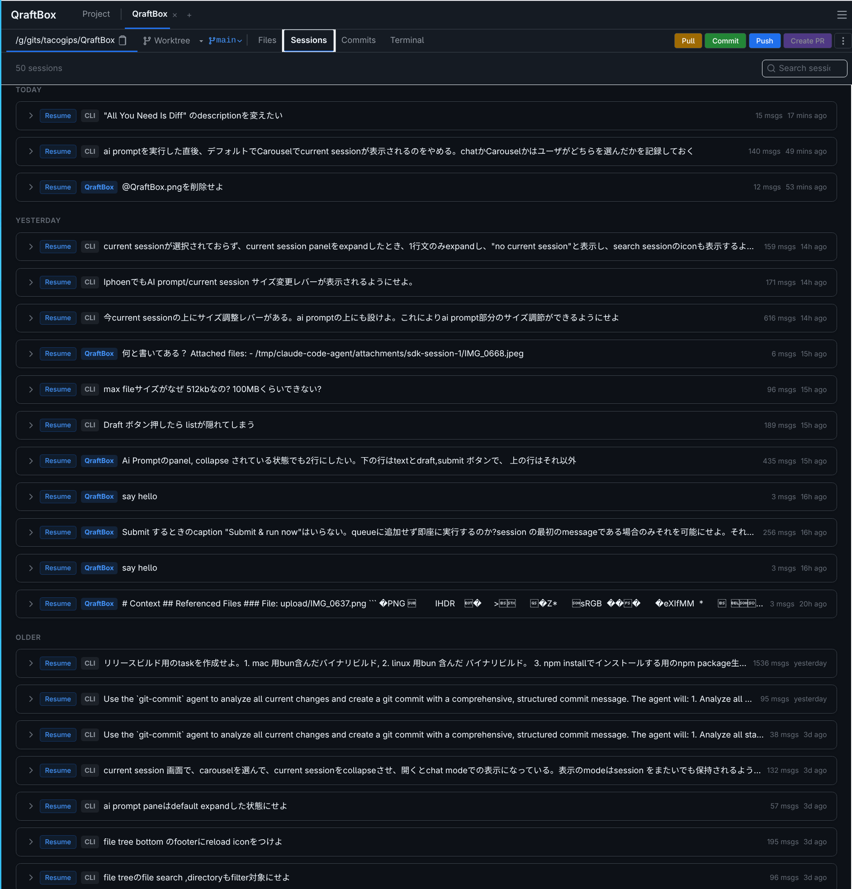
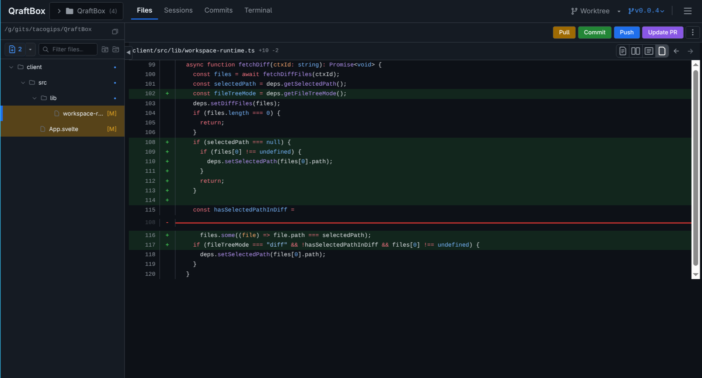
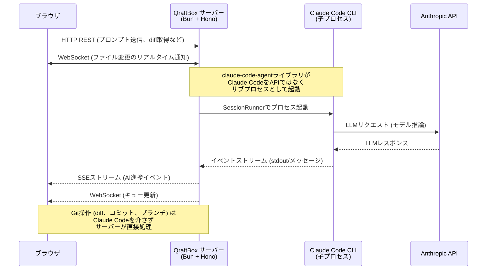

# QraftBox

**All You Need Is Diff.**

QraftBox is a local tool for viewing code changes (diffs), managing git branches, and performing AI-powered git operations -- all from your web browser.

> [Japanese / 日本語はこちら](#日本語-japanese)

## SECURITY WARNING

> **QraftBox is under active development. It is NOT production-ready.**
>
> QraftBox starts a web server on your machine. **If you expose this server to the public internet, anyone can access your code, files, and git operations.** This is a serious security risk.
>
> **Rules to keep yourself safe:**
>
> 1. **ONLY use QraftBox on your local machine** (localhost / 127.0.0.1). Do not open the port to the internet.
> 2. **If you need remote access**, use a VPN such as [Tailscale](https://tailscale.com/), [WireGuard](https://www.wireguard.com/), or [ZeroTier](https://www.zerotier.com/). These create a private encrypted network so only your devices can connect.
> 3. **NEVER expose QraftBox directly to the public internet** without proper authentication and encryption.
>
> **The developers of QraftBox assume absolutely no responsibility or liability for any damage, data loss, security breach, or any other harm resulting from the use of this software.** Use it entirely at your own risk.

## What is QraftBox?

If you write code and use git, QraftBox helps you with these everyday tasks:

- **See what changed** -- View diffs (the differences between file versions) in a clean, readable format. Choose between inline view (changes shown in one column) or side-by-side view (old version on the left, new version on the right).
- **Manage branches** -- Switch between git branches, view branch lists, and work with git worktrees (multiple working directories for the same repository).
- **AI-powered git operations** -- Use `claude-code-agent` (Claude Code CLI) to write commit messages, push code, and create pull requests with AI assistance.
- **Browse AI sessions** -- View past AI sessions and their transcripts.
- **Work with multiple projects** -- Open multiple directories in tabs, just like a browser.
- **Real-time updates** -- QraftBox watches your files and updates the view automatically when files change.
- **Comment on diffs** -- Add and view comments stored via git notes.
- **Built-in tools & terminal** -- Access tool registry info and open a browser terminal per project.
- **Model configuration** -- Manage AI model profiles and operation bindings from the UI.

## Feature Status

### Implemented

- Diff viewer (inline / side-by-side)
- Git branch and worktree management
- AI-assisted git operations (commit / push / pull request)
- AI session browsing
- Multi-directory tabs
- Real-time file watching updates
- Built-in tool registry and browser terminal
- AI model profile and operation binding management

### Planned

- Orchestration
- Workflow
- Codex integration
- Scheduling
- Git notes comments on diffs

## How it Works (Simple Explanation)

1. You run QraftBox on your computer. It starts a small web server.
2. You open your web browser and go to `http://localhost:7144`.
3. You see a web page where you can browse your git repositories, view diffs, and perform git operations.

That's it. Everything runs on your machine. When AI features are enabled, prompts are sent to the configured AI provider via `claude-code-agent`, and tool plugins may call external services depending on their configuration.

### Architecture Overview



---

## Installation

### Quick Install (One Command)

```bash
curl -fsSL https://raw.githubusercontent.com/tacogips/QraftBox/main/install.sh | bash
```

This downloads a pre-built binary for your platform (macOS / Linux, x64 / arm64) and installs it to `~/.local/bin`.

**Options:**

```bash
# Install via npm instead (installs Bun automatically if needed)
curl -fsSL https://raw.githubusercontent.com/tacogips/QraftBox/main/install.sh | bash -s -- --npm

# Install a specific version
curl -fsSL https://raw.githubusercontent.com/tacogips/QraftBox/main/install.sh | bash -s -- --version 0.0.1

# Install to a custom directory
curl -fsSL https://raw.githubusercontent.com/tacogips/QraftBox/main/install.sh | bash -s -- --install-dir /usr/local/bin
```

**Uninstall:**

```bash
curl -fsSL https://raw.githubusercontent.com/tacogips/QraftBox/main/install.sh | bash -s -- --uninstall
```

This removes the binary, client assets, and PATH entries added by the installer.

**Prerequisites:** Git is required. For AI features, you also need [Claude Code](https://docs.anthropic.com/en/docs/claude-code/overview).

---

### Other Installation Methods

There are 3 additional ways to install QraftBox. Pick whichever is easiest for you.

#### Prerequisites

Before installing QraftBox, you need:

| Tool | What it is | How to check if you have it |
|------|-----------|----------------------------|
| **Git** | Version control system | Run `git --version` in your terminal |
| **Bun** | JavaScript runtime (like Node.js, but faster) | Run `bun --version` in your terminal |

**Install Bun** (if you don't have it):

```bash
# macOS / Linux
curl -fsSL https://bun.sh/install | bash

# Windows (PowerShell)
powershell -c "irm bun.sh/install.ps1 | iex"
```

**Install Git** (if you don't have it): [https://git-scm.com/downloads](https://git-scm.com/downloads)

For AI features, you also need **Claude Code**: [https://docs.anthropic.com/en/docs/claude-code/overview](https://docs.anthropic.com/en/docs/claude-code/overview)

---

#### Method 1: Download a Binary (Recommended -- Easiest)

Pre-built binaries include everything needed. No Bun installation required.

1. Go to the [Releases page](https://github.com/tacogips/QraftBox/releases)
2. Download the file for your OS:

   | Your computer | Download this file |
   |---|---|
   | Mac (Apple Silicon: M1/M2/M3/M4) | `qraftbox-vX.X.X-darwin-arm64.tar.gz` |
   | Mac (Intel) | `qraftbox-vX.X.X-darwin-x64.tar.gz` |
   | Linux (x86_64) | `qraftbox-vX.X.X-linux-x64.tar.gz` |
   | Linux (ARM64) | `qraftbox-vX.X.X-linux-arm64.tar.gz` |

3. Extract and run:

```bash
# Extract (replace the filename with the one you downloaded)
tar xzf qraftbox-v0.0.1-darwin-arm64.tar.gz

# Go into the directory
cd qraftbox-v0.0.1-darwin-arm64

# Run it
./qraftbox
```

4. Open `http://localhost:7144` in your browser. Done.

**Tip -- "Not sure which Mac I have?"**
Click the Apple menu > "About This Mac". If it says "Apple M1" (or M2, M3, M4), download `darwin-arm64`. Otherwise, download `darwin-x64`.

---

#### Method 2: Install via npm (Requires Bun)

```bash
# Install globally
npm install -g qraftbox

# Run it
qraftbox
```

Or run without installing:

```bash
bunx qraftbox
```

Open `http://localhost:7144` in your browser.

> **Note**: The npm package requires Bun as the runtime. It will NOT work with Node.js.

---

#### Method 3: Build from Source (For developers)

```bash
# Clone the repository
git clone https://github.com/tacogips/QraftBox.git
cd QraftBox

# Install dependencies
bun install

# Build the client (web UI)
cd client && bun install && bun run build && cd ..

# Start QraftBox
bun run start
```

Open `http://localhost:7144` in your browser.

---

### Install via Claude Code Slash Command

If you are using [Claude Code](https://docs.anthropic.com/en/docs/claude-code/overview) inside the QraftBox repository, you can install QraftBox with:

```
/install-qraftbox
```

This slash command wraps the install script and accepts the same options:

```
/install-qraftbox --npm                        # Install via npm
/install-qraftbox --version 0.0.1              # Specific version
/install-qraftbox --install-dir /usr/local/bin  # Custom directory
/install-qraftbox --uninstall                   # Remove QraftBox
```

---

## Usage

### Basic Usage

```bash
# Start QraftBox (default: http://localhost:7144)
qraftbox

# Start on a specific port
qraftbox --port 8080

# Open a specific project directory
qraftbox /path/to/your/project

# Open multiple project directories
qraftbox -d /path/to/project1 -d /path/to/project2

# Open browser automatically on start
qraftbox --open
```

### Feature Preview (Video / Images)

#### Overview Video

<video src="usage/resource/movie.mp4" controls muted playsinline width="100%"></video>

#### UI Screenshots

- Diff viewer (side-by-side)

  

- Current file diff

  

- Stacked diff view

  

- File tree (normal view)

  

- File tree (diff status)

  

- Commit history

  

- AI session history

  

- Browser terminal

  

### Run as a Daemon with PM2 (Bun)

Based on Bun's PM2 guide: https://bun.com/docs/guides/ecosystem/pm2

```bash
# Start QraftBox in daemon mode via PM2
task pm2:start

# Start on a custom port/host
task pm2:start PORT=7155 HOST=127.0.0.1

# Check status and logs
task pm2:status
task pm2:logs

# Stop / restart / remove the process
task pm2:stop
task pm2:restart
task pm2:delete
```

### All Options

```
Usage: qraftbox [options] [projectPath]

Options:
  -p, --port <number>              Server port (default: 7144)
  -h, --host <string>              Server host (default: "localhost")
  --open                           Open browser automatically
  --watch                          Enable file watching (default: true)
  --no-watch                       Disable file watching
  -s, --sync-mode <mode>           Git sync mode: manual, auto-push, auto-pull, auto
                                   (default: "manual")
  --no-ai                          Disable AI features
  --assistant-additional-args <args>  Comma-separated args passed to AI assistant
  -d, --project-dir <paths...>     Project directories to open at startup
  -V, --version                    Show version number
  --help                           Show help
```

### Example Workflows

**View diffs in your current project:**

```bash
cd /path/to/your/git/repo
qraftbox
```

**Open multiple projects at once:**

```bash
qraftbox -d ~/projects/frontend -d ~/projects/backend --open
```

**Run on a different port (if 7144 is already in use):**

```bash
qraftbox --port 3000
```

---

## Development

If you want to contribute or modify QraftBox:

```bash
# Clone and install
git clone https://github.com/tacogips/QraftBox.git
cd QraftBox
bun install

# Run in development mode (auto-reloads on code changes)
task dev

# Run tests
task test

# Type check
task typecheck

# Build everything
task build:client
task build:server

# See all available commands
task
```

### Release Build

```bash
# Build binaries for all platforms + npm package
task release:all

# Build and publish to GitHub Releases
task release:github

# Build only Mac binaries
task release:mac

# Build only Linux binaries
task release:linux

# Build npm package only
task release:npm

# Build npm package and run locally
task release:npm-run
```

## License

This project is licensed under the [MIT License](LICENSE).

---

---

## 日本語 (Japanese)

**All You Need Is Diff.**

QraftBox は、コードの変更（diff）を見たり、gitブランチを管理したり、AIを使ったgit操作を行うためのローカルツールです。すべてウェブブラウザから操作できます。

> [English / 英語版はこちら](#qraftbox)

## セキュリティに関する重要な警告

> **QraftBox は開発中のソフトウェアです。本番環境での利用を想定していません。**
>
> QraftBox はあなたのコンピュータ上でウェブサーバーを起動します。**このサーバーをインターネットに公開すると、誰でもあなたのコード、ファイル、git操作にアクセスできてしまいます。** これは重大なセキュリティリスクです。
>
> **安全に使うためのルール:**
>
> 1. **QraftBox はローカルマシン上でのみ使用してください**（localhost / 127.0.0.1）。ポートをインターネットに開放しないでください。
> 2. **リモートアクセスが必要な場合**は、[Tailscale](https://tailscale.com/)、[WireGuard](https://www.wireguard.com/)、[ZeroTier](https://www.zerotier.com/) などの VPN を使用してください。これらはプライベートな暗号化ネットワークを作成し、あなたのデバイスだけが接続できるようにします。
> 3. **適切な認証と暗号化なしに、QraftBox を公開インターネットに直接さらさないでください。**
>
> **QraftBox の開発者は、このソフトウェアの使用により生じたいかなる損害、データ損失、セキュリティ侵害、その他のあらゆる被害について、一切の責任を負いません。** すべて自己責任でご利用ください。

## QraftBox とは?

コードを書いて git を使っている人なら、QraftBox は日常のこんな作業を助けてくれます:

- **変更内容を見る** -- diff（ファイルのバージョン間の差分）を見やすい形式で表示します。インライン表示（1列で変更を表示）とサイドバイサイド表示（左に旧バージョン、右に新バージョン）を選べます。
- **ブランチを管理する** -- git ブランチの切り替え、ブランチ一覧の表示、git ワークツリー（同じリポジトリで複数の作業ディレクトリを持つ機能）の操作ができます。
- **AIによるgit操作** -- `claude-code-agent`（Claude Code CLI）を使って、コミットメッセージの作成、コードのプッシュ、プルリクエストの作成をAIの支援のもと行えます。
- **AIセッションを閲覧する** -- 過去のAIセッションとそのやり取りの記録を見ることができます。
- **複数プロジェクトで作業する** -- ブラウザのタブのように、複数のディレクトリをタブで開けます。
- **リアルタイム更新** -- QraftBox はファイルを監視し、変更があると自動的に画面を更新します。
- **差分コメント** -- git notes を使って差分にコメントを残せます。
- **ツールとターミナル** -- ツール登録の情報確認や、プロジェクトごとのブラウザ内ターミナルが使えます。
- **モデル設定** -- UI からAIモデルのプロファイルと操作ごとの割り当てを管理できます。

## 機能ステータス

### 実装済み

- Diffビューア（インライン / サイドバイサイド）
- Gitブランチ / ワークツリー管理
- AI支援のGit操作（コミット / プッシュ / プルリクエスト）
- AIセッション閲覧
- 複数ディレクトリのタブ管理
- ファイル監視によるリアルタイム更新
- ツールレジストリとブラウザ内ターミナル
- AIモデルプロファイルと操作バインディング管理

### 実装予定

- オーケストレーション
- ワークフロー
- Codex連携
- スケジュール実装
- 差分へのGit notesコメント

## 仕組み（かんたんな説明）

1. あなたのコンピュータで QraftBox を起動します。小さなウェブサーバーが立ち上がります。
2. ウェブブラウザを開いて `http://localhost:7144` にアクセスします。
3. git リポジトリの閲覧、diff の表示、git操作ができるウェブページが表示されます。

以上です。すべてあなたのマシン上で動きます。AI機能を有効にすると、`claude-code-agent` 経由で設定されたAIプロバイダにプロンプトが送信されます。また、ツールプラグインは設定に応じて外部サービスへアクセスする場合があります。

### アーキテクチャ概要



---

## インストール

### クイックインストール（1コマンド）

```bash
curl -fsSL https://raw.githubusercontent.com/tacogips/QraftBox/main/install.sh | bash
```

お使いのプラットフォーム（macOS / Linux、x64 / arm64）に合ったビルド済みバイナリをダウンロードし、`~/.local/bin` にインストールします。

**オプション:**

```bash
# npm 経由でインストール（Bun が未インストールの場合は自動でインストール）
curl -fsSL https://raw.githubusercontent.com/tacogips/QraftBox/main/install.sh | bash -s -- --npm

# バージョンを指定してインストール
curl -fsSL https://raw.githubusercontent.com/tacogips/QraftBox/main/install.sh | bash -s -- --version 0.0.1

# インストール先を指定
curl -fsSL https://raw.githubusercontent.com/tacogips/QraftBox/main/install.sh | bash -s -- --install-dir /usr/local/bin
```

**アンインストール:**

```bash
curl -fsSL https://raw.githubusercontent.com/tacogips/QraftBox/main/install.sh | bash -s -- --uninstall
```

バイナリ、クライアントアセット、インストーラが追加した PATH 設定を削除します。

**前提条件:** Git が必要です。AI機能を使う場合は [Claude Code](https://docs.anthropic.com/en/docs/claude-code/overview) も必要です。

---

### その他のインストール方法

他にも3つの方法があります。お好きな方法を選んでください。

#### 前提条件

QraftBox をインストールする前に、以下が必要です:

| ツール | 説明 | インストール済みか確認する方法 |
|--------|------|-------------------------------|
| **Git** | バージョン管理システム | ターミナルで `git --version` を実行 |
| **Bun** | JavaScriptランタイム（Node.jsの高速版） | ターミナルで `bun --version` を実行 |

**Bun のインストール**（まだ入っていない場合）:

```bash
# macOS / Linux
curl -fsSL https://bun.sh/install | bash

# Windows (PowerShell)
powershell -c "irm bun.sh/install.ps1 | iex"
```

**Git のインストール**（まだ入っていない場合）: [https://git-scm.com/downloads](https://git-scm.com/downloads)

AI機能を使う場合は **Claude Code** も必要です: [https://docs.anthropic.com/en/docs/claude-code/overview](https://docs.anthropic.com/en/docs/claude-code/overview)

---

#### 方法1: バイナリをダウンロード（おすすめ -- 一番かんたん）

ビルド済みバイナリには必要なものがすべて含まれています。Bunのインストールは不要です。

1. [Releases ページ](https://github.com/tacogips/QraftBox/releases) にアクセス
2. あなたのOSに合ったファイルをダウンロード:

   | あなたのPC | ダウンロードするファイル |
   |---|---|
   | Mac (Apple Silicon: M1/M2/M3/M4) | `qraftbox-vX.X.X-darwin-arm64.tar.gz` |
   | Mac (Intel) | `qraftbox-vX.X.X-darwin-x64.tar.gz` |
   | Linux (x86_64) | `qraftbox-vX.X.X-linux-x64.tar.gz` |
   | Linux (ARM64) | `qraftbox-vX.X.X-linux-arm64.tar.gz` |

3. 展開して実行:

```bash
# 展開（ファイル名はダウンロードしたものに置き換えてください）
tar xzf qraftbox-v0.0.1-darwin-arm64.tar.gz

# ディレクトリに移動
cd qraftbox-v0.0.1-darwin-arm64

# 実行
./qraftbox
```

4. ブラウザで `http://localhost:7144` を開く。以上！

**ヒント -- 「自分のMacがどれか分からない？」**
Appleメニュー > 「このMacについて」をクリック。「Apple M1」（またはM2, M3, M4）と表示されていれば `darwin-arm64` をダウンロード。それ以外なら `darwin-x64` をダウンロード。

---

#### 方法2: npm でインストール（Bunが必要）

```bash
# グローバルインストール
npm install -g qraftbox

# 実行
qraftbox
```

インストールせずに実行することもできます:

```bash
bunx qraftbox
```

ブラウザで `http://localhost:7144` を開いてください。

> **注意**: npm パッケージの実行には Bun が必要です。Node.js では動作しません。

---

#### 方法3: ソースからビルド（開発者向け）

```bash
# リポジトリをクローン
git clone https://github.com/tacogips/QraftBox.git
cd QraftBox

# 依存関係をインストール
bun install

# クライアント（Web UI）をビルド
cd client && bun install && bun run build && cd ..

# QraftBox を起動
bun run start
```

ブラウザで `http://localhost:7144` を開いてください。

---

### Claude Code スラッシュコマンドでインストール

QraftBox リポジトリ内で [Claude Code](https://docs.anthropic.com/en/docs/claude-code/overview) を使用している場合、以下のコマンドでインストールできます:

```
/install-qraftbox
```

このスラッシュコマンドはインストールスクリプトのラッパーで、同じオプションが使えます:

```
/install-qraftbox --npm                        # npm 経由でインストール
/install-qraftbox --version 0.0.1              # バージョン指定
/install-qraftbox --install-dir /usr/local/bin  # インストール先を指定
/install-qraftbox --uninstall                   # QraftBox を削除
```

---

## 使い方

### 基本的な使い方

```bash
# QraftBox を起動（デフォルト: http://localhost:7144）
qraftbox

# ポートを指定して起動
qraftbox --port 8080

# 特定のプロジェクトディレクトリを開く
qraftbox /path/to/your/project

# 複数のプロジェクトディレクトリを開く
qraftbox -d /path/to/project1 -d /path/to/project2

# 起動時にブラウザを自動で開く
qraftbox --open
```

### 機能プレビュー（動画 / 画像）

#### 概要動画

<video src="usage/resource/movie.mp4" controls muted playsinline width="100%"></video>

#### UIスクリーンショット

- 差分ビュー（左右比較）

  

- 現在ファイルの差分表示

  

- スタック表示の差分ビュー

  

- ファイルツリー（通常表示）

  

- ファイルツリー（差分ステータス）

  

- コミット履歴

  

- AIセッション履歴

  

- ブラウザターミナル

  

### PM2でデーモン化して実行する（Bun）

Bun公式のPM2ガイドに準拠: https://bun.com/docs/guides/ecosystem/pm2

```bash
# PM2でQraftBoxをデーモン起動
task pm2:start

# ポート/ホストを指定して起動
task pm2:start PORT=7155 HOST=127.0.0.1

# 状態確認とログ確認
task pm2:status
task pm2:logs

# 停止 / 再起動 / 登録削除
task pm2:stop
task pm2:restart
task pm2:delete
```

### 全オプション一覧

```
Usage: qraftbox [options] [projectPath]

Options:
  -p, --port <number>              サーバーポート（デフォルト: 7144）
  -h, --host <string>              サーバーホスト（デフォルト: "localhost"）
  --open                           起動時にブラウザを自動で開く
  --watch                          ファイル監視を有効にする（デフォルト: true）
  --no-watch                       ファイル監視を無効にする
  -s, --sync-mode <mode>           Git同期モード: manual, auto-push, auto-pull, auto
                                   （デフォルト: "manual"）
  --no-ai                          AI機能を無効にする
  --assistant-additional-args <args>  AIアシスタントに渡す追加引数（カンマ区切り）
  -d, --project-dir <paths...>     起動時に開くプロジェクトディレクトリ
  -V, --version                    バージョン番号を表示
  --help                           ヘルプを表示
```

### 使用例

**現在のプロジェクトのdiffを見る:**

```bash
cd /path/to/your/git/repo
qraftbox
```

**複数のプロジェクトを同時に開く:**

```bash
qraftbox -d ~/projects/frontend -d ~/projects/backend --open
```

**別のポートで起動する（7144が使用中の場合）:**

```bash
qraftbox --port 3000
```

---

## 開発

QraftBox の開発に参加したい場合:

```bash
# クローンとインストール
git clone https://github.com/tacogips/QraftBox.git
cd QraftBox
bun install

# 開発モードで起動（コード変更時に自動リロード）
task dev

# テストを実行
task test

# 型チェック
task typecheck

# すべてビルド
task build:client
task build:server

# 利用可能なコマンド一覧
task
```

### リリースビルド

```bash
# 全プラットフォーム向けバイナリ + npm パッケージをビルド
task release:all

# ビルドして GitHub Releases に公開
task release:github

# Mac バイナリのみビルド
task release:mac

# Linux バイナリのみビルド
task release:linux

# npm パッケージのみビルド
task release:npm

# npm パッケージをビルドしてローカルで実行
task release:npm-run
```

## ライセンス

このプロジェクトは [MIT License](LICENSE) のもとで公開されています。
